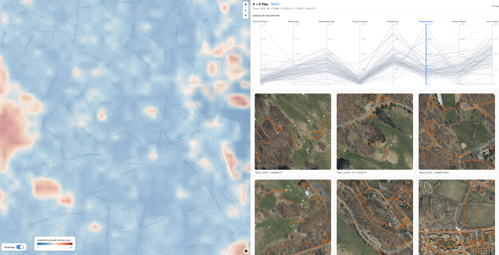

# Sidewalk Stewards
 

 
Stewards is a visual analytics tool for detecting, verifying, and repairing pedestrian network errors from aerial imagery through an interactive human-in-the-loop workflow.

> **About the included data and model**
>
> The `stewards_files` package distributed with this repository contains **sample data for a single neighborhood in Boston (Dorchester) only**.
>
> The package also includes a **placeholder model** (untrained / minimally trained weights) so that the training and inference interactions in the UI function end-to-end.

---

## Prerequisites

Before setting up Stewards, make sure you have the following installed:

| Requirement | Version | Notes |
|---|---|---|
| Node.js | ≥ 20.19.0 | Required by Vite/React |
| npm | ≥ 8.0.0 | Bundled with Node.js |
| Python | ≥ 3.9 | For the backend and tile server |
| pip | latest | For Python dependencies |
| Google Maps API Key | — | Required for Street View integration |

---

## Repository Structure

After cloning and placing all required files, your project should look like this:

```
stewards/
├── .env                          ← You create this (see Step 3)
├── public/
│   ├── polygons.geojson          ← Global sidewalk polygons
│   └── network.geojson           ← Global pedestrian network
├── src/                          ← React frontend source
├── backend/
│   ├── server.py                 ← FastAPI server entry point
│   ├── requirements.txt
│   └── stewards_files/
│       ├── map_tiles/            ← Raster map tiles for the tile server
│       └── boston/
│           ├── tiles/            ← Sample satellite imagery tiles for Dorchester, Boston
│           ├── masks_tile2net_polygons/   ← tile2net prediction masks (Dorchester sample)
│           ├── masks_confidence/          ← Confidence score masks (Dorchester sample)
│           ├── masks_groundtruth_polygons/ ← Ground-truth polygon masks (Dorchester sample)
│           └── stewards_scripts/
│               ├── train_from_suggestions.py
│               ├── apply_model.py
│               ├── helper_scripts/
│               └── output/       ← Placeholder model weights; trained checkpoints saved here
└── vite.config.js
```
---
 
## Step 0 — Create a Conda Environment and Install tile2net
 
It is strongly recommended to run Stewards inside a dedicated conda environment. tile2net is not available on PyPI and must be installed from source before the rest of the Python dependencies.
 
**Create and activate the environment:**
 
```bash
conda create -n stewards python=3.10
conda activate stewards
```
 
**Clone and install tile2net from source:**
 
```bash
git clone https://github.com/VIDA-NYU/tile2net.git
cd tile2net
pip install -e .
cd ..
```
 
> Keep the `tile2net/` folder wherever you cloned it — the `-e` flag installs it in editable mode, so the folder must remain in place. You do not need to place it inside the Stewards project directory.
 
> All subsequent steps assume the `stewards` conda environment is active. Run `conda activate stewards` at the start of every session before launching any of the three processes.
 
---

## Step 1 — Clone the Repository

```bash
git clone https://github.com/urban-toolkit/sidewalk-stewards.git
cd stewards
```

---

## Step 2 — Download and Place the Data Folder
 
The `stewards_files` folder (~600 MB) contains the sample data for the Dorchester neighborhood of Boston along with a placeholder model. It is distributed as a release asset on GitHub due to file size.
 
> **Warning:** If you have a previous version of `stewards_files/` in `./backend/`, delete it entirely before extracting the new archive. Do not merge or overwrite — remove the old folder first to avoid stale files causing conflicts.
> ```bash
> rm -rf backend/stewards_files
> ```
 
**Option A — Command line** (from the project root):

```bash
# Download
curl -L -o backend/stewards_files.zip \
  https://github.com/urban-toolkit/sidewalk-stewards/releases/download/v1.0-data/stewards_files.zip

# Unzip into ./backend/
unzip backend/stewards_files.zip -d backend/

# Clean up
rm backend/stewards_files.zip
```

**Option B — Manual:** Download `stewards_files.zip` from the [Releases page](https://github.com/urban-toolkit/sidewalk-stewards/releases/tag/v1.0-data), unzip it, and move the resulting `stewards_files/` folder into `./backend/`.

After extraction the structure should be:

```
stewards_files/
├── map_tiles/                      ← Used by the tile server (port 8000)
└── boston/
    ├── tiles/                      ← Dorchester sample only
    ├── masks_tile2net_polygons/    ← Dorchester sample only
    ├── masks_confidence/           ← Dorchester sample only
    ├── masks_groundtruth_polygons/ ← Dorchester sample only
    └── stewards_scripts/
        ├── train_from_suggestions.py
        ├── apply_model.py
        ├── helper_scripts/
        └── output/                 ← Placeholder model weights live here
```

---

## Step 3 — Create Your `.env` File

Create a file named `.env` in the **project root** (`stewards/.env`). This file configures all local file paths and your Google Maps API key.

```dotenv
# ── Satellite tile directories ──
TILES_DIR=C:/Users/your_user/path/to/stewards/backend/stewards_files/boston/tiles

# ── tile2net prediction mask directory ──
T2N_DIR=C:/Users/your_user/path/to/stewards/backend/stewards_files/boston/masks_tile2net_polygons

# ── Confidence score mask directory ──
CONF_DIR=C:/Users/your_user/path/to/stewards/backend/stewards_files/boston/masks_confidence

# ── Ground-truth polygon mask directory ──
GT_DIR=C:/Users/your_user/path/to/stewards/backend/stewards_files/boston/masks_groundtruth_polygons

# ── Global GeoJSON files (served from /public) ──
ORIGINAL_POLYGONS=C:/Users/your_user/path/to/stewards/public/polygons.geojson
ORIGINAL_NETWORK=C:/Users/your_user/path/to/stewards/public/network.geojson
OUTPUT_POLYGONS=C:/Users/your_user/path/to/stewards/public/polygons.geojson
OUTPUT_NETWORK=C:/Users/your_user/path/to/stewards/public/network.geojson


# ── Directory where trained model checkpoints are saved ──
TRANED_MODEL_OUTPUT=C:/Users/your_user/path/to/stewards/backend/stewards_files/boston/stewards_scripts/output

# ── Helper scripts directory (training utilities) ──
HELPERS_PATH=C:/Users/your_user/path/to/stewards/backend/stewards_files/boston/stewards_scripts/helper_scripts

# ── Stewards ML scripts directory ──
SCRIPT_PATH=C:/Users/your_user/path/to/stewards/backend/stewards_files/boston/stewards_scripts

# ── Google Maps API key (for Street View) ──
VITE_GOOGLE_MAPS_KEY=your_google_maps_api_key_here
```

> **Windows & macOS:** Use forward slashes (`/`) in all paths. Python handles them correctly on all platforms, including Windows.

> **Important:** All paths must be **absolute, full paths** — not relative paths or bare directory names.

---

## Step 4 — Install Frontend Dependencies

From the **project root**:

```bash
npm install
```

This installs React, MapLibre GL JS, Vite, and all other frontend dependencies.

---

## Step 5 — Install Python Dependencies

From the **`./backend`** folder:

```bash
cd backend
pip install -r requirements.txt
```

This installs FastAPI, Uvicorn, geopandas, pyogrio, PyTorch, and all other backend dependencies.

> **Note:** If you are on a system with multiple Python environments (e.g., conda), make sure you are installing into the correct environment that will be used to run the server.

---

## Step 6 — Run the Application

Stewards requires **three processes running simultaneously**, each in its own terminal. Start them in the order listed below.

---

### Terminal 1 — Frontend Dev Server

From the **project root**:

```bash
npm run dev
```

Starts the Vite development server. The app will be available at:

```
http://localhost:5173
```

---

### Terminal 2 — Backend API Server

From the **`./backend`** folder:

```bash
cd backend
uvicorn server:app --reload --port 8001
```

Starts the FastAPI server that handles training and inference requests. The API runs at:

```
http://localhost:8001
```

> The Vite dev server proxies `/api/*` requests to this port automatically — no additional configuration needed.

---

### Terminal 3 — Map Tile Server

From the **project root**:

```bash
python -m http.server 8000 --directory ./backend/stewards_files/map_tiles
```

Serves the raster map tile files used as the base map. Tiles are requested by the frontend at:

```
http://localhost:8000/{z}/{x}/{y}.png
```

---

## Verifying the Setup

Once all three processes are running, open your browser at **http://localhost:5173**.

You should see:
- The map loads with raster tiles from the tile server.
- Sidewalk polygon overlays are visible on the map.
- The sidebar shows tile cards at the appropriate zoom levels.

If anything fails to load, check the browser console and each terminal for error messages.

---

## Troubleshooting

**Map tiles are blank or show a 404**  
Confirm the tile server (Terminal 3) is running and that `./backend/stewards_files/map_tiles/` exists and contains tile files in `{z}/{x}/{y}.png` format.

**Polygons or network don't appear**  
Confirm that `public/polygons.geojson` and `public/network.geojson` exist at the project root.

**Backend returns a 500 error on training or inference**  
Check that all `.env` paths are correct and point to existing directories. Confirm that `stewards_scripts/` contains `train_from_suggestions.py` and `apply_model.py`, and that Python dependencies are installed in the same environment used to run Uvicorn.

**Encoding error on Windows during training or inference**  
Ensure you are using Python ≥ 3.9. The backend explicitly sets `encoding="utf-8"` on all subprocesses, but older Python versions may ignore this on some Windows configurations.

**Street View panel does not load**  
Confirm that `VITE_GOOGLE_MAPS_KEY` is set correctly in `.env` and that the key has the **Maps JavaScript API** and **Street View Static API** enabled in the Google Cloud Console.

---

## Port Reference

| Service | Port | Start from |
|---|---|---|
| Frontend (Vite) | 5173 | Project root |
| Backend API (FastAPI) | 8001 | `./backend/` |
| Map Tile Server | 8000 | Project root |